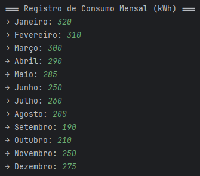
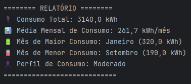

# 📘 Desafio Final – Fundamentos de Java

Este projeto foi desenvolvido como parte do **Desafio Final** do curso **Entra21 – Fundamentos de Java**.

---

## Contextualização

Uma empresa de consultoria está desenvolvendo um protótipo em linha de comando para monitorar o consumo mensal de energia elétrica em residências. Com base nesses dados, o sistema apresente:

- O **consumo total** do período;
- O **mês de maior e menor consumo**;
- A **média de consumo**;
- Uma **classificação do perfil de consumo** (baixo, moderado ou elevado).

A aplicação será um protótipo de **linha de comando**, com foco em simular a lógica e o comportamento do sistema antes de ser integrado a uma solução com interface gráfica ou banco de dados.

---

## Requisitos do Programa

### Desenvolver um programa que:

- Solicite ao usuário os valores de **consumo mensal (kWh)** durante os **12 meses do ano**;
- Armazene os dados em um **vetor** de tamanho 12;
- Utilize **funções específicas** para:
    - Calcular o **consumo total**;
    - Calcular a **média mensal**;
    - Identificar o **mês com maior e menor consumo**;
    - Classificar o consumo mensal como:
        - Até 150 kWh → **Baixo**
        - De 151 a 300 kWh → **Moderado**
        - Acima de 300 kWh → **Elevado**
- Apresente um **relatório final completo e organizado** no terminal;
- Utilize **boas práticas de codificação**, como nomes claros, indentação adequada e comentários explicativos;
- Modularize o código, utilizando **funções além do `main()`**.

---

## 📥 Exemplo de Entradas (Input)

---

## 📤 Resultados Gerados (Output)

