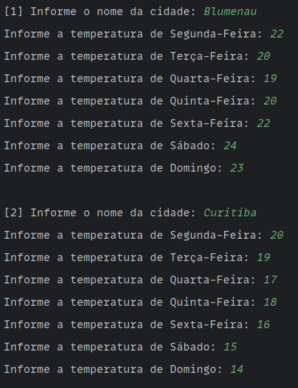
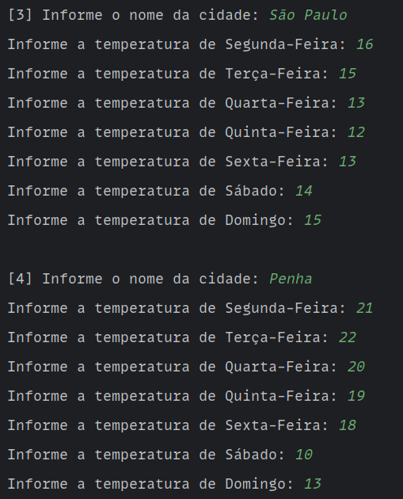
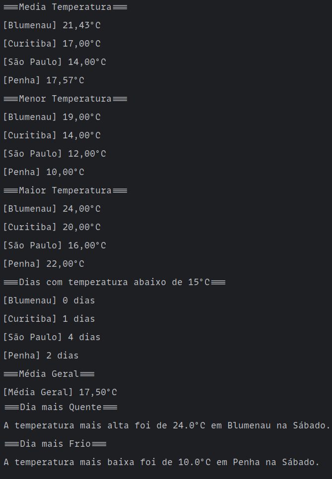

# 📘 Avaliação Prática 01 – Fundamentos de Java

Este projeto foi desenvolvido como parte da **Avaliação Prática 01** do curso **Entra21 – Fundamentos de Java**.

---

## Contextualização

Você foi contratado para desenvolver um **sistema simples de monitoramento climático**. O sistema deverá armazenar temperaturas diárias coletadas em diferentes regiões do país durante uma semana, permitir a entrada dos dados por meio de uma matriz, e fornecer relatórios estatísticos legíveis e organizados.

---

## Requisitos do Programa

### Desenvolver um programa que:

- Utilize uma matriz bidimensional `4x7` para representar 4 cidades e 7 dias da semana;

- Solicite ao usuário a entrada manual das temperaturas, cidade por cidade, dia por dia; 

- Calcula e exiba a **temperatura média semanal** de cada cidade;

- Calcula e exiba a **maior** e a **menor temperatura** registradas no total;

- Calcula e exiba a **quantidade de dias com temperatura inferior a 15°C** para cada cidade;

- Organize os dados e resultados de maneira clara no terminal;  

- Utilize **pelo menos dois métodos** além do `main()` para modularização;  

- Siga **boas práticas de codificação**, como nomes claros de variáveis, indentação e comentários.
### Funcionalidades Opcionais

- Cálculo da **temperatura média geral** entre todas as cidades e dias;
- Identificação dos **dias mais quentes** e **mais frios** da semana;
- Geração de **relatório em arquivo `.txt`** com os dados processados.

---

## 📥 Exemplo de Entradas (Input)

  
  &nbsp;&nbsp;&nbsp;
  

---

## 📤 Resultados Gerados (Output)

